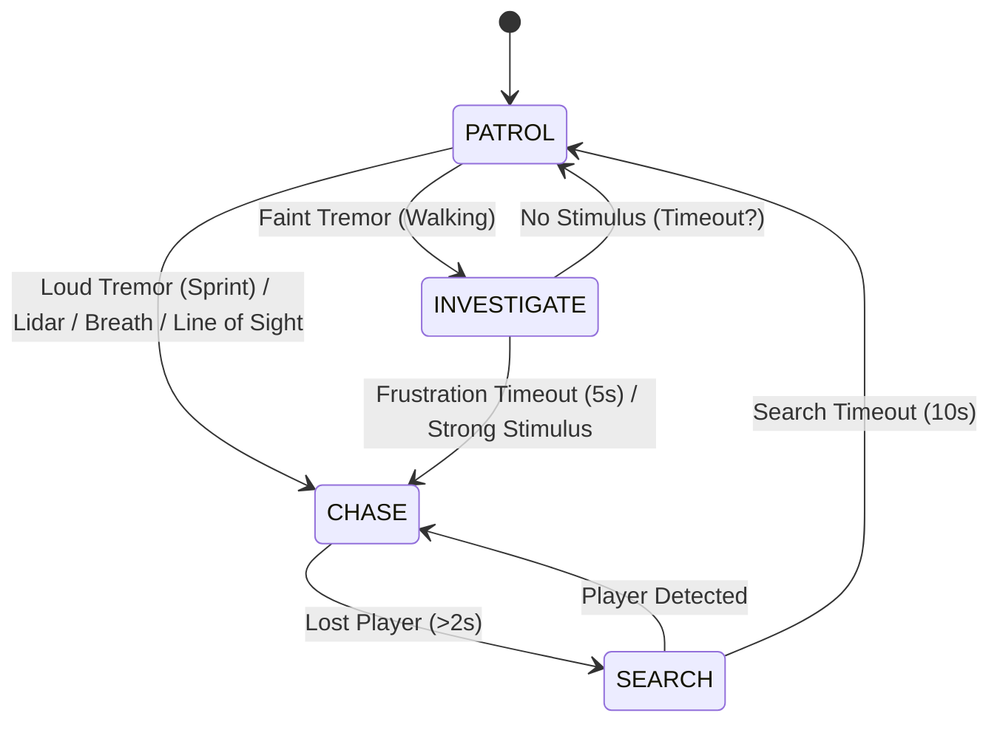

# Enemy AI State Transitions

The Enemy AI uses a Finite State Machine (FSM) with 4 primary states: **PATROL**, **INVESTIGATE**, **CHASE**, and **SEARCH**.

## State Diagram

## State Descriptions

### 1. PATROL
- **Behavior**: Moves randomly between waypoints.
- **Speed**: Slow (`patrolSpeed`).
- **Triggers**:
  - **To INVESTIGATE**: Detects faint tremor (player walking nearby).
  - **To CHASE**: Detects loud tremor (sprinting), Lidar pulse, or Breath (very close).

### 2. INVESTIGATE
- **Behavior**: Moves towards the source of the faint tremor.
- **Speed**: Medium (`investigateSpeed`).
- **Triggers**:
  - **To CHASE**: 
    - **Frustration**: If investigating for >5 seconds without finding player.
    - **Strong Stimulus**: Detects sprinting, Lidar, or Breath.
  - **To PATROL**: (Implicit) If stimulus is lost and frustration doesn't trigger (currently logic favors frustration -> chase).

### 3. CHASE
- **Behavior**: Aggressively pursues the player's current position.
- **Speed**: Fast (`huntSpeed`).
- **Logic**:
  - Updates target to player's **exact position** continuously if detected.
  - Uses **Breath Detection** to track player even if stationary (within range).
  - **Direct Movement**: Bypasses pathfinding if close (<1m) and clear line of sight.
- **Triggers**:
  - **To SEARCH**: If player is not detected (no tremor, no breath, no lidar) for >2 seconds.

### 4. SEARCH
- **Behavior**: Moves to the last known position (LKP) and looks around.
- **Speed**: Medium (`investigateSpeed`).
- **Logic**:
  - Stays in search mode for `searchDuration` (default 10s).
  - Picks random points near LKP.
- **Triggers**:
  - **To PATROL**: After `searchDuration` expires.
  - **To CHASE**: If player is detected again.

## Sensory System

| Sense | Range | Condition | Triggers |
|-------|-------|-----------|----------|
| **Lidar** | 10-50m | Line of Sight to pulse origin | CHASE |
| **Tremor (Walk)** | 5-50m | Player Walking | INVESTIGATE |
| **Tremor (Sprint)** | 10-100m | Player Sprinting | CHASE |
| **Breath** | 0.5-10m | Proximity (Occlusion check) | CHASE |

*Note: Breath radius triples if player is panting.*
